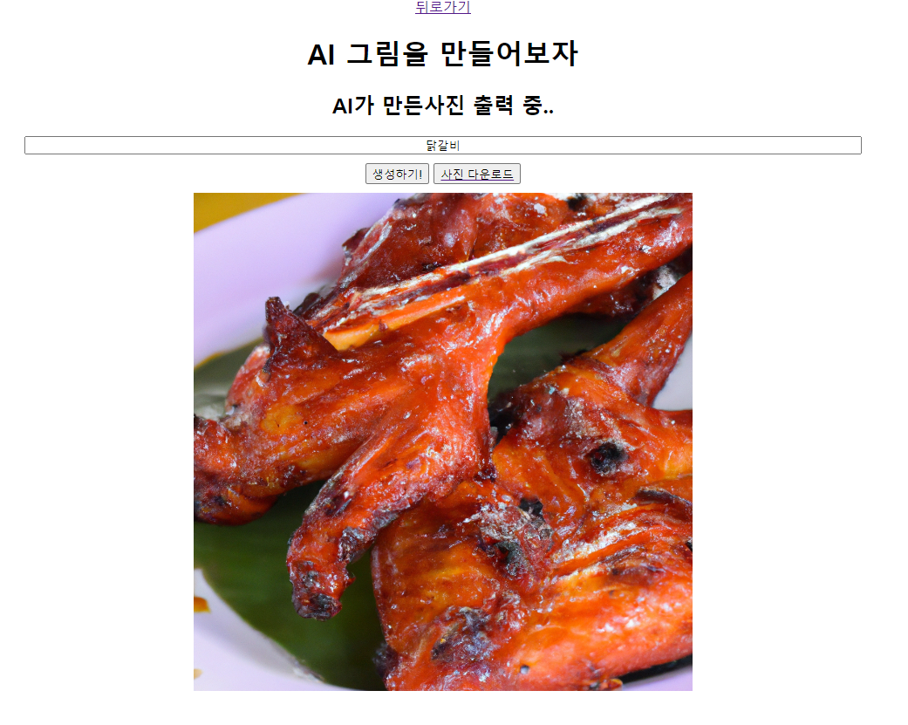
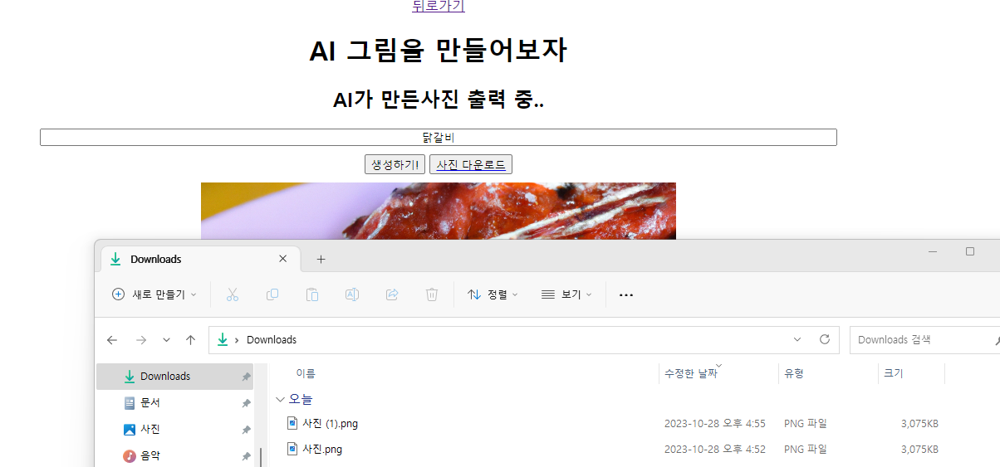

# AI-picture
AI 그림 만들기 사이트 프로젝트 입니다.

## 메인화면
 
메인화면이다. 위의 하이퍼 링크를 통해 각 페이지로 이동할 수 있다.    

## '텍스트를 이미지로'화면
 
메인화면에서 '텍스트를 이미지로'를 눌렀을 때 이동하는 화면이다. 빈 칸에 텍스트를 넣고 생성하기를 누르면..    
 
AI가 생성한 사진이 출력된다. 클라이언트 input을 서버로 전송하면 input을 [네이버 파파고 API](https://developers.naver.com/docs/papago/papago-nmt-overview.md)를 통해 번역하고 [OpenAI의 image generation API](https://beta.openai.com/docs/api-reference/images/create)를 통해 이미지를 생성, 저장해서 클라이언트에게 출력해준다. 파파고로 번역하는 이유는 OpenAI의 한국어 인식이 좋지 않기 때문이다. 이후 새로 생긴 '사진다운로드'버튼을 클릭하면..    
 
'사진.png'가 다운로드 된다!    

## '이미지를 이미지로'화면
 
메인화면에서 '이미지를 이미지로'를 눌렀을 때 이동하는 화면이다. 파일을 업로드하면..    
 
자신이 업로드한 사진이 출력된다. 여기서 '사진자르기'를 클릭하면..    
 
[cropperjs](https://github.com/fengyuanchen/cropperjs)를 사용한 모달창이 나오면서 사진을 잘라야한다. [OpenAI image variation](https://beta.openai.com/docs/api-reference/images/create-variation)은 4MB이하 정사각형 PNG 사진만 인식할 수 있기에 사진은 정사각형으로만 자를 수 있다. 영역을 선택하고 '자르기'를 클릭하면..    
 
자신이 자른 사진이 출력된다. 이제 '보내기!!'버튼을 누르자. 이때, 4MB이하 정사각형 PNG 사진만 인식할 수 있기 때문에 [compressorjs](https://github.com/fengyuanchen/compressorjs)를 이용하여 이미지를 압축한다. 실험결과, 이미지 품질을 원본대비 60%로 압축하였더니 수천만화소의 핸드폰 카메라 사진도 4MB를 넘지 않았다. 그리고 canvas의 toBlob()을 이용하면 PNG blob을 생성할 수 있다.    
 
그럼 OpenAI가 생성한 사진이 옆에 출력된다.
